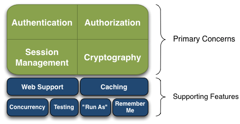
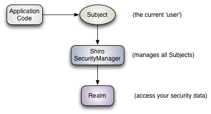
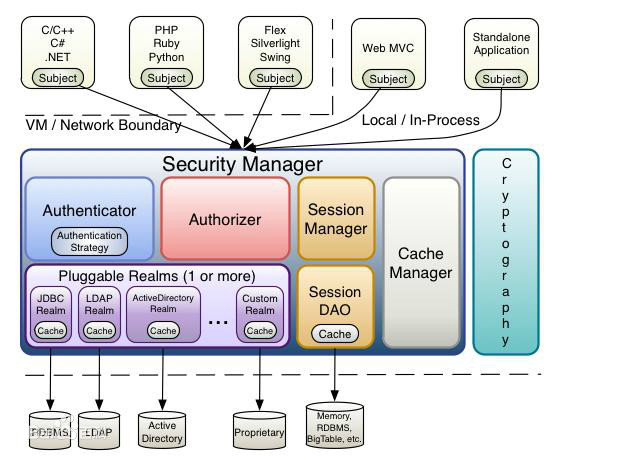
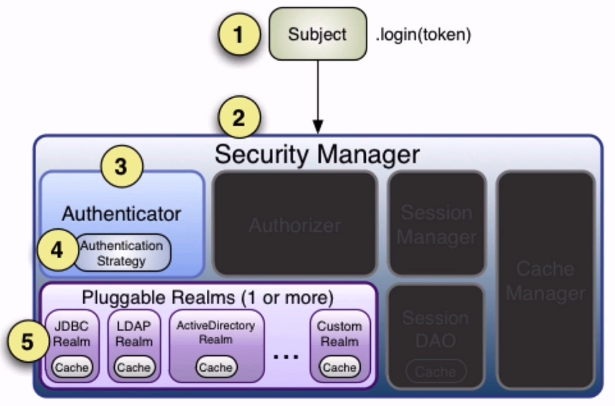
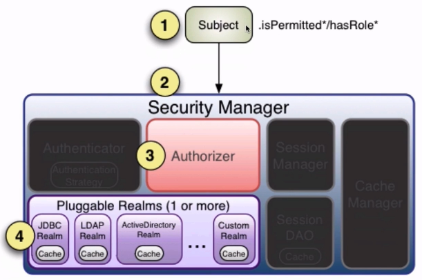
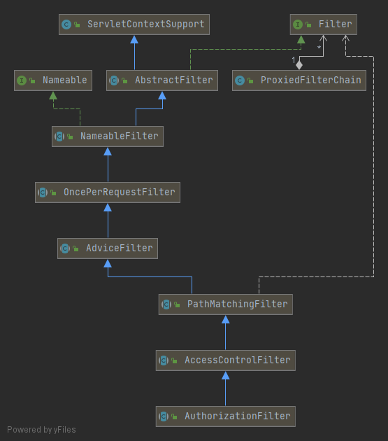
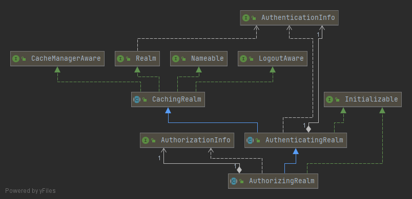

# Apache Shiro

## 参考网站
1. [shiro笔记一](https://blog.csdn.net/u011781521/article/details/55094751)
2. [shiro笔记二](https://blog.csdn.net/u011781521/article/details/74857440)
3. [shiro笔记三](https://blog.csdn.net/u011781521/article/details/74892074)
4. [shiro笔记四](https://blog.csdn.net/u011781521/article/details/74907197)
5. [shiro笔记五](https://blog.csdn.net/u011781521/article/details/75172983)
---
## 主要功能

1. Primary Concerns
    ```
    1. Authentication       身份认证
    2. Authorization        授权
    3. Session Management   会话管理
    4. Cryptography         密码系统
    ```
2. Supporting Features
    ```
    1. Web Support          Web 支持
    2. Caching              缓存
    3. Concurrency          并发
    4. Testing              测试
    5. "Run As"             一个用户"假装"为另外一个用户的身份
    6. Remember Me          记住用户身份，使得下次不需要再登录
    ```
- Shiro 不会去维护用户、维护权限，需要我们自己去设计和提供，然后通过相应的接口注入给 Shiro
---
## 主要组件

```
1. Subject              主体
   - 与当前应用交互的任何东西都可以是 Subject，所有 Subject 都绑定到 SecurityManager
   - 门面
2. SecurityManager      安全管理器
   - 所有与安全有关的操作都会与 SecurityManager 交互；Shiro 的核心，也负责与其它组件进行交互
   - 前端控制器
3. Realm                域
   - Shiro 从 Realm 认证和授权的相应数据（用户、角色、权限），并完成相应的认证和授权操作
   - 安全数据源
```
---
## 架构

```
1. Subject              主体
2. Security Manager     安全管理器
3. Authenticator        认证器
   - Subject 的信息由 AuthenticationToken 来储存，由 AuthenticationStrategy 进行认证
   - 用户可以自定义实现
4. Authorizer           授权器
5. Session Manager      会话管理器
   - DefaultSessionManager             JavaSE 环境
   - ServletContainerSessionManager    Web 环境，直接使用 Servlet 会话
   - DefaultWebSessionManager          Web 环境，自己维护会话
6. SessionDao           CRUD
7. Cache Manger         缓存管理器
8. Pluggable Realms     可扩展领域
   - 可配置1个或多个，如果只有1个 Realm，则无需配置 AuthenticationStrategy ?
9. Cryptography         密码系统
```
---
## Authentication


---
## Authorization


```
1. Subject     主体
2. Resource    资源
3. Permission  许可
4. Role        角色

Subject → Role → Permission
```
---
## [Filter](https://www.cnblogs.com/yoohot/p/6085830.html)


---
## Session Manager

- Shiro 提供了完整的企业级会话管理功能，不依赖于底层容器 (Tomcat)，JavaSE JavaEE 环境都可以使用。
- 提供了会话管理，会话事监听，会话存储/持久化，容器无关的集群，失效过期支持，对Web的透明支持，SSO单点登录等
---
## Cache Manager


---
## Realm


---